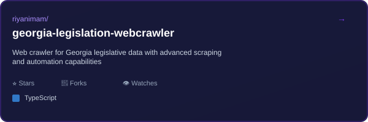

<div align="center">

<h1>Hey, I'm Riyan! ✨</h1>
<p><b>AWS & Backend Developer • Cloud Architect • Problem Solver</b></p>
<p>
<a href="https://github.com/riyanimam"></a>
<a href="https://www.linkedin.com/in/riyanimam"></a>
<a href="mailto:riyanimam1997@gmail.com"></a>
</p>
</div>

<div align="center">

</div>

<div align="center">

</div>

---

## 🚀 About Me

AWS & Backend Developer passionate about building scalable cloud solutions and automation tools. I specialize in serverless architecture, infrastructure-as-code, and event-driven systems. With expertise in Python, Go, and TypeScript, I craft high-performance applications and intelligent deployment pipelines that eliminate manual overhead.

---

## ✨ What I Do

- ☁️ Build serverless applications on AWS Lambda with Go, Python, and TypeScript
- 🏗️ Design event-driven infrastructure using Terraform and GitHub Actions
- 🤖 Create automation tools and bots for workflow optimization
- 📊 Extract and process data from web sources with elegant solutions
- 🔄 Implement CI/CD pipelines and infrastructure-as-code best practices
- 📚 Write comprehensive documentation for every project

---

## 🛠️ Tech Stack

<table align="center">
<tr>
<td colspan="4" align="center"><b>Languages & Runtimes</b></td>
</tr>
<tr>
<td align="center"><br />TypeScript</td>
<td align="center"><br />Python</td>
<td align="center"><br />Go</td>
<td align="center"><br />Node.js</td>
</tr>
<tr>
<td colspan="4" align="center"><b>Frontend & Web</b></td>
</tr>
<tr>
<td align="center"><br />React</td>
<td align="center"><br />Tailwind</td>
<td align="center"><br />Vite</td>
<td align="center"><br />HTML</td>
</tr>
<tr>
<td colspan="4" align="center"><b>Cloud & Infrastructure</b></td>
</tr>
<tr>
<td align="center"><br />AWS</td>
<td align="center"><br />Terraform</td>
<td align="center"><br />Docker</td>
<td align="center"><br />PostgreSQL</td>
</tr>
<tr>
<td colspan="4" align="center"><b>Developer Tools</b></td>
</tr>
<tr>
<td align="center"><br />GitHub</td>
<td align="center"><br />Git</td>
<td align="center"><br />Bash</td>
<td align="center"><br />VSCode</td>
</tr>
</table>

---

## 📊 GitHub Analytics

<div align="center">

</div>

<div align="center">

</div>

<div align="center">

</div>

<div align="center">

</div>

<div align="center">

</div>

---

## 🏆 Achievements

<div align="center">

</div>

---

## 📌 Featured Projects

<div align="center">
<a href="https://github.com/riyanimam/georgia-legislation-webcrawler">

</a>
</div>

---

## 📈 Coding Activity

### Recent Activity

<!--START_SECTION:activity-->
1. 🎉 Merged PR [#3](https://github.com/riyanimam/riyanimam/pull/3) in [riyanimam/riyanimam](https://github.com/riyanimam/riyanimam)
2. 💪 Opened PR [#3](https://github.com/riyanimam/riyanimam/pull/3) in [riyanimam/riyanimam](https://github.com/riyanimam/riyanimam)
3. ℹ️ Assigned PR [#3](https://github.com/riyanimam/riyanimam/pull/3) in [riyanimam/riyanimam](https://github.com/riyanimam/riyanimam)
4. 🎉 Merged PR [#2](https://github.com/riyanimam/riyanimam/pull/2) in [riyanimam/riyanimam](https://github.com/riyanimam/riyanimam)
5. 💪 Opened PR [#2](https://github.com/riyanimam/riyanimam/pull/2) in [riyanimam/riyanimam](https://github.com/riyanimam/riyanimam)
6. ℹ️ Assigned PR [#2](https://github.com/riyanimam/riyanimam/pull/2) in [riyanimam/riyanimam](https://github.com/riyanimam/riyanimam)
7. 🎉 Merged PR [#1](https://github.com/riyanimam/riyanimam/pull/1) in [riyanimam/riyanimam](https://github.com/riyanimam/riyanimam)
8. 💪 Opened PR [#1](https://github.com/riyanimam/riyanimam/pull/1) in [riyanimam/riyanimam](https://github.com/riyanimam/riyanimam)
9. ℹ️ Assigned PR [#1](https://github.com/riyanimam/riyanimam/pull/1) in [riyanimam/riyanimam](https://github.com/riyanimam/riyanimam)
10. 🗣 Commented on [#1](https://github.com/riyanimam/common-repo-assets/pull/1#issuecomment-3787398718) in [riyanimam/common-repo-assets](https://github.com/riyanimam/common-repo-assets)
<!--END_SECTION:activity-->

### WakaTime Stats

<!--START_SECTION:waka-->


**🐱 My GitHub Data** 

> 📦 4.4 kB Used in GitHub's Storage 
 > 
> 🏆 193 Contributions in the Year 2026
 > 
> 💼 Opted to Hire
 > 
> 📜 14 Public Repositories 
 > 
> 🔑 4 Private Repositories 
 > 
**I'm an Early 🐤** 

```text
🌞 Morning                15 commits          ██░░░░░░░░░░░░░░░░░░░░░░░   06.44 % 
🌆 Daytime                102 commits         ███████████░░░░░░░░░░░░░░   43.78 % 
🌃 Evening                116 commits         ████████████░░░░░░░░░░░░░   49.79 % 
🌙 Night                  0 commits           ░░░░░░░░░░░░░░░░░░░░░░░░░   00.00 % 
```
📅 **I'm Most Productive on Tuesday** 

```text
Monday                   18 commits          ██░░░░░░░░░░░░░░░░░░░░░░░   07.73 % 
Tuesday                  96 commits          ██████████░░░░░░░░░░░░░░░   41.20 % 
Wednesday                22 commits          ██░░░░░░░░░░░░░░░░░░░░░░░   09.44 % 
Thursday                 51 commits          █████░░░░░░░░░░░░░░░░░░░░   21.89 % 
Friday                   26 commits          ███░░░░░░░░░░░░░░░░░░░░░░   11.16 % 
Saturday                 16 commits          ██░░░░░░░░░░░░░░░░░░░░░░░   06.87 % 
Sunday                   4 commits           ░░░░░░░░░░░░░░░░░░░░░░░░░   01.72 % 
```


📊 **This Week I Spent My Time On** 

```text
🕑︎ Time Zone: America/New_York

💬 Programming Languages: 
No Activity Tracked This Week

🔥 Editors: 
No Activity Tracked This Week

🐱‍💻 Projects: 
No Activity Tracked This Week

💻 Operating System: 
No Activity Tracked This Week
```

**I Mostly Code in Go** 

```text
Go                       3 repos             ██████░░░░░░░░░░░░░░░░░░░   23.08 % 
TypeScript               2 repos             ████░░░░░░░░░░░░░░░░░░░░░   15.38 % 
HTML                     1 repo              ██░░░░░░░░░░░░░░░░░░░░░░░   07.69 % 
PowerShell               1 repo              ██░░░░░░░░░░░░░░░░░░░░░░░   07.69 % 
HCL                      1 repo              ██░░░░░░░░░░░░░░░░░░░░░░░   07.69 % 
```


**Timeline**


 Last Updated on 03/02/2026 20:22:57 UTC
<!--END_SECTION:waka-->

---

## 🎯 Current Focus

- 🔍 Researching advanced data pipelines and streaming architectures
- 🛠️ Building next-generation cloud automation tools
- 📚 Creating comprehensive infrastructure templates
- 🚀 Exploring emerging serverless patterns

---

## 😄 Daily Dev Inspiration

<div align="center">

</div>

---

## 📊 Profile Metrics

<div align="center">


</div>

---

## 🤝 Let's Connect & Collaborate

<div align="center">
<p>I'm always interested in collaborating on cloud projects, automation tools, and open-source initiatives.</p>
<p>Feel free to reach out via email, LinkedIn, or GitHub!</p>

</div>

<br>

<div align="center">
<sub>Last updated: February 3, 2026</sub>
</div>
