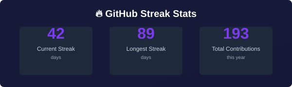

## ❤️ A Special Thank You

Special thank you to a few people who have guided me in my career—keeping this anonymous just in case. You know who you are.

Thank you to **KD** for introducing me to the world of IT, for being my first true mentor in both the profession and in life, and for helping me see how things really work before I got pulled in blindly. Thank you for pushing me to pursue software engineering, even when I doubted I could do it.

Thank you to **DC** and **MP**. I may never be able to fully express how deeply indebted I am to you both for my growth and career. From teaching me code and Git when I was just starting out, to equipping me with the mindset and tools that set me apart—you gave me a foundation I’ll carry forever. Everything I’ve built, and everything I will build, stands on what you helped me create.

Last but not least, thank you to **ZI**. My path into technology would be nothing without you. I hope I’m making you prouder than ever—and that you’re up there being as loud as always.

---

<div align="center">

<h1>Hey, I'm Riyan! ✨</h1>
<p><b>AWS & Backend Developer • Cloud Architect • Problem Solver</b></p>
<p>
<a href="https://github.com/riyanimam"></a>
<a href="https://www.linkedin.com/in/riyanimam"></a>
<a href="mailto:riyanimam1997@gmail.com"></a>
</p>
</div>

<div align="center">

</div>

<div align="center">

</div>

---

## 📋 Table of Contents

- [🚀 About Me](#-about-me)
- [✨ What I Do](#-what-i-do)
- [🛠️ Tech Stack](#️-tech-stack)
- [🚧 Currently Building](#-currently-building)
- [📌 Featured Projects](#-featured-projects)
- [📊 GitHub Analytics](#-github-analytics)
- [🏆 Achievements & Certifications](#-achievements--certifications)
- [📈 Coding Activity](#-coding-activity)
- [🤝 Work With Me](#-work-with-me)
- [💬 Let's Connect](#-lets-connect--collaborate)

---

## 🚀 About Me

AWS & Backend Developer passionate about building scalable cloud solutions and automation tools. I specialize in **serverless architecture**, **infrastructure-as-code**, and **event-driven systems**.

With deep expertise in **AWS services** (Lambda, DynamoDB, EventBridge, Step Functions, API Gateway, S3, CloudFormation), I architect and deploy production-grade applications that scale automatically and cost-effectively. My polyglot approach with **Python**, **Go**, and **TypeScript** enables me to choose the right tool for each challenge—whether it's high-performance Lambda functions, data processing pipelines, or modern web applications.

I believe in **automation-first development**, comprehensive documentation, and building systems that are both powerful and maintainable.

---

## ✨ What I Do

- ☁️ Build serverless applications on AWS Lambda with Go, Python, and TypeScript
- 🏗️ Design event-driven infrastructure using Terraform and GitHub Actions
- 🤖 Create automation tools and bots for workflow optimization
- 📊 Extract and process data from web sources with elegant solutions
- 🔄 Implement CI/CD pipelines and infrastructure-as-code best practices
- 📚 Write comprehensive documentation for every project

---

## 🛠️ Tech Stack

<table align="center">
<tr>
<td colspan="4" align="center"><b>Languages & Runtimes</b></td>
</tr>
<tr>
<td align="center"><br />TypeScript</td>
<td align="center"><br />Python</td>
<td align="center"><br />Go</td>
<td align="center"><br />Node.js</td>
</tr>
<tr>
<td colspan="4" align="center"><b>Frontend & Web</b></td>
</tr>
<tr>
<td align="center"><br />React</td>
<td align="center"><br />Tailwind</td>
<td align="center"><br />Vite</td>
<td align="center"><br />HTML</td>
</tr>
<tr>
<td colspan="4" align="center"><b>Cloud & Infrastructure</b></td>
</tr>
<tr>
<td align="center"><br />AWS</td>
<td align="center"><br />Terraform</td>
<td align="center"><br />Docker</td>
<td align="center"><br />PostgreSQL</td>
</tr>
<tr>
<td colspan="4" align="center"><b>Developer Tools</b></td>
</tr>
<tr>
<td align="center"><br />GitHub</td>
<td align="center"><br />Git</td>
<td align="center"><br />Bash</td>
<td align="center"><br />VSCode</td>
</tr>
</table>

---

## 🚧 Currently Building

<table>
<tr>
<td width="50%">

### 🏛️ Georgia Legislation Webcrawler
**Real-time legislative tracking platform**
- React + TypeScript frontend with Tailwind CSS
- Python backend with LegiScan API integration
- AI-powered bill summaries using local LLMs
- Automated CI/CD with GitHub Actions

[View Project →](https://github.com/riyanimam/georgia-legislation-webcrawler)

</td>
<td width="50%">

### 🤖 Discord Bot Playground
**Extensible Discord bot framework in Go**
- Built with DiscordGo library
- Essential commands (ping, help, info)
- Server and user utilities
- Perfect starter for bot development

[View Project →](https://github.com/riyanimam/discord-bot-playground)

</td>
</tr>
</table>

---

## 📊 GitHub Analytics

<p align="center">
  
  
</p>

<p align="center">
  
</p>

<div align="center">


</div>

---

## 🏆 Achievements & Certifications

<div align="center">

</div>

### 📜 Certifications & Learning

**🎓 Certifications**

- ☁️ AWS Certified Cloud Practitioner
- 🏗️ HashiCorp Certified: Terraform Associate

**📚 Continuous Learning**

- Advanced Serverless Patterns
- Distributed Systems Design
- Cloud Cost Optimization
- Data Engineering Best Practices

---

---

## 📌 Featured Projects

### 🏛️ Georgia Legislation Webcrawler

<div align="center">

[](https://github.com/riyanimam/georgia-legislation-webcrawler)

</div>

**Real-time legislative tracking with AI-powered insights**

🔧 Tech: React • TypeScript • Python • Tailwind CSS • Vite • GitHub Actions

⭐ Features: LegiScan API Integration • Local LLM Summaries • PWA Support • Real-time Updates

---

### 🔔 Signal Bot Playground

<div align="center">

[](https://github.com/riyanimam/signal-bot-playground)

</div>

**Messaging automation sandbox for Signal platform**

🔧 Tech: Go • Signal API • Bot Framework

⭐ Features: Message Responders • Automated Workflows • Testing Environment • Extensible Architecture

---

### 💼 Personal Portfolio Website

<div align="center">

[](https://github.com/riyanimam/personal-site)

</div>

**Modern portfolio showcasing AWS & Backend expertise**

🔧 Tech: TypeScript • HTML • GitHub Pages • GitHub Actions

⭐ Features: Responsive Design • PWA Support • SEO Optimized • Accessibility First • Dark Mode

🌐 [**Visit Live Site →**](https://riyanimam.github.io/personal-site/)

---

### 💰 AWS Cost Optimizer Lambda

*In Development*

**Automated AWS cost optimization using serverless architecture**

🔧 Tech: Python • AWS Lambda • CloudWatch • EventBridge • Terraform

⭐ Features:

- Real-time cost anomaly detection
- Automated resource rightsizing recommendations
- Idle resource identification and cleanup
- Multi-account cost analysis
- Slack/Email notifications for cost alerts
- Custom optimization rules engine

💡 *Designed to reduce AWS bills by 20-40% through intelligent automation*

---

## 📈 Coding Activity

### 📍 Recent Activity

<!--START_SECTION:activity-->
*Recent GitHub activity will be automatically updated here*
<!--END_SECTION:activity-->

### ⏱️ WakaTime Stats

> **Note:** WakaTime integration is available but currently not configured. To enable automatic coding stats, set up WakaTime with your GitHub Actions workflow.

<!--START_SECTION:waka-->


**🐱 My GitHub Data** 

> 📦 14.9 kB Used in GitHub's Storage 
 > 
> 🏆 260 Contributions in the Year 2026
 > 
> 💼 Opted to Hire
 > 
> 📜 18 Public Repositories 
 > 
> 🔑 4 Private Repositories 
 > 
**I'm an Early 🐤** 

```text
🌞 Morning                52 commits          ███░░░░░░░░░░░░░░░░░░░░░░   13.27 % 
🌆 Daytime                145 commits         █████████░░░░░░░░░░░░░░░░   36.99 % 
🌃 Evening                185 commits         ████████████░░░░░░░░░░░░░   47.19 % 
🌙 Night                  10 commits          █░░░░░░░░░░░░░░░░░░░░░░░░   02.55 % 
```
📅 **I'm Most Productive on Thursday** 

```text
Monday                   20 commits          █░░░░░░░░░░░░░░░░░░░░░░░░   05.10 % 
Tuesday                  116 commits         ███████░░░░░░░░░░░░░░░░░░   29.59 % 
Wednesday                27 commits          ██░░░░░░░░░░░░░░░░░░░░░░░   06.89 % 
Thursday                 118 commits         ████████░░░░░░░░░░░░░░░░░   30.10 % 
Friday                   27 commits          ██░░░░░░░░░░░░░░░░░░░░░░░   06.89 % 
Saturday                 68 commits          ████░░░░░░░░░░░░░░░░░░░░░   17.35 % 
Sunday                   16 commits          █░░░░░░░░░░░░░░░░░░░░░░░░   04.08 % 
```


📊 **This Week I Spent My Time On** 

```text
🕑︎ Time Zone: America/New_York

💬 Programming Languages: 
No Activity Tracked This Week

🔥 Editors: 
No Activity Tracked This Week

🐱‍💻 Projects: 
No Activity Tracked This Week

💻 Operating System: 
No Activity Tracked This Week
```

🤖 **AI Coding This Week** 

```text
No AI Coding Activity Tracked This Week
```

**I Mostly Code in TypeScript** 

```text
TypeScript               4 repos             ██████░░░░░░░░░░░░░░░░░░░   25.00 % 
Go                       3 repos             █████░░░░░░░░░░░░░░░░░░░░   18.75 % 
JavaScript               2 repos             ███░░░░░░░░░░░░░░░░░░░░░░   12.50 % 
HTML                     1 repo              ██░░░░░░░░░░░░░░░░░░░░░░░   06.25 % 
PowerShell               1 repo              ██░░░░░░░░░░░░░░░░░░░░░░░   06.25 % 
```


**Timeline**


 Last Updated on 05/08/2026 00:33:52 UTC
<!--END_SECTION:waka-->

---

## 🤝 Work With Me

### 💼 Open to Opportunities

**🎯 What I'm Looking For:**

- ☁️ Cloud Architecture & AWS Development Projects
- 🤖 Automation & DevOps Engineering Roles
- 🚀 Serverless & Event-Driven System Design
- 📚 Open Source Collaboration
- 💡 Technical Consulting & Advisory

**📅 Availability:** Open to freelance projects and full-time opportunities

**🌍 Location:** Remote-friendly • EST Timezone

<div align="center">

<a href="https://riyanimam.github.io/personal-site/">

</a>
<a href="mailto:riyanimam1997@gmail.com">

</a>
<a href="https://www.linkedin.com/in/riyanimam">

</a>

</div>

---

## 🎯 Current Focus

- 🔍 Researching advanced data pipelines and streaming architectures
- 🛠️ Building next-generation cloud automation tools
- 📚 Creating comprehensive infrastructure templates
- 🚀 Exploring emerging serverless patterns

---

## 📊 Profile Metrics

<div align="center">


</div>

---

## 💬 Let's Connect & Collaborate

### 🌟 Why Work Together?

> *"Building scalable solutions that solve real problems, one Lambda function at a time."*

**I'm passionate about:**

- 🤝 Collaborating on cloud-native projects
- 🛠️ Contributing to open-source initiatives
- 📖 Sharing knowledge through documentation and mentoring
- 🚀 Building automation tools that empower developers

<div align="center">

### 📬 Get In Touch

<a href="https://github.com/riyanimam">

</a>
<a href="https://www.linkedin.com/in/riyanimam">

</a>
<a href="mailto:riyanimam1997@gmail.com">

</a>

<br><br>


**💡 Have a project idea? Let's discuss how we can bring it to life!**

</div>

<br>

<div align="center">
<sub>Last updated: February 3, 2026</sub>
</div>
